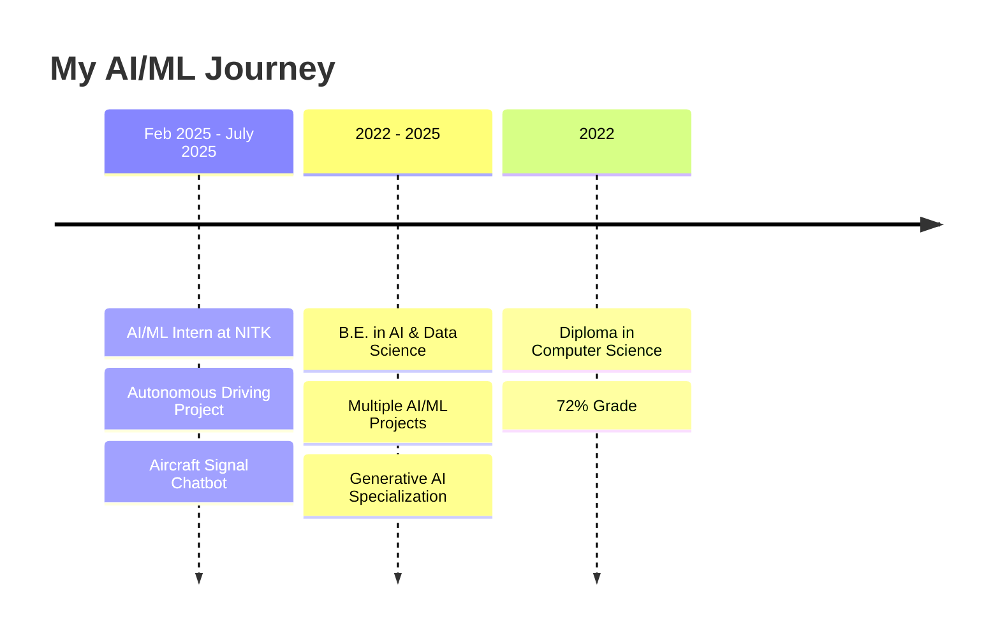
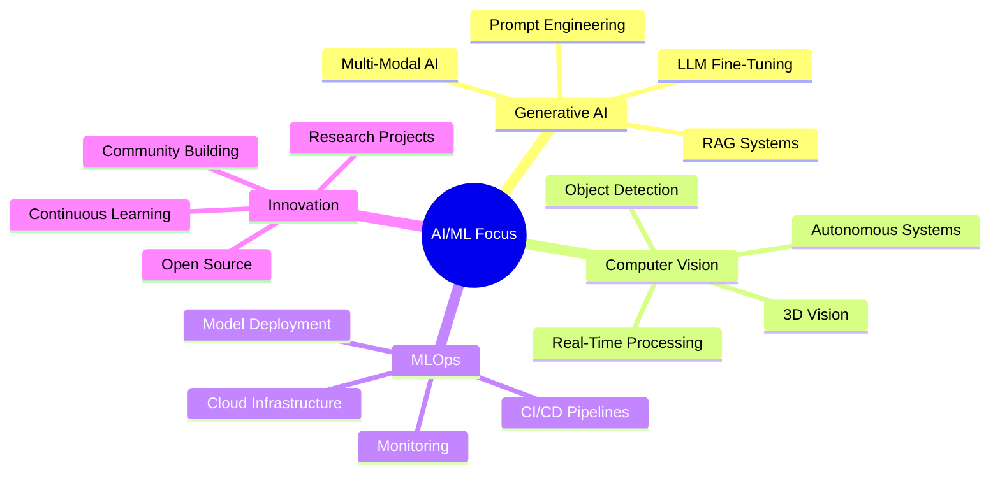

#  Hey there, I'm Sudeep N Shetty

<div align="center">
  
</div>

<p align="center">
  
  <a href="https://github.com/sudeepshetty-629?tab=followers">
    
  </a>
</p>

<p align="center">
  <a href="mailto:sudeepshetty0629@gmail.com"></a>
  <a href="https://linkedin.com/in/sudeep-shetty-3882b2348"></a>
  <a href="https://github.com/sudeepshetty-629"></a>
</p>

---

## 🚀 About Me

```python
class AIEngineer:
    def __init__(self):
        self.name = "Sudeep N Shetty"
        self.role = "AI & ML Engineer"
        self.location = "Mangalore, Karnataka, India"
        self.education = "B.E. in AI & Data Science"
        self.current_focus = [
            "Generative AI & LLMs",
            "Computer Vision",
            "Autonomous Systems",
            "RAG Architectures"
        ]
        
    def say_hi(self):
        print("Thanks for dropping by! Let's build something amazing together!")

me = AIEngineer()
me.say_hi()
```

🎓 **AI & Data Science Engineering Student** @ Sahyadri College of Engineering  
🔬 **AI/ML Intern** @ National Institute of Technology Karnataka (NITK)  
💡 Passionate about building intelligent systems that solve real-world problems  
🌟 Currently working on **Autonomous Driving Simulation** & **LLM-Powered Chatbots**

---

## 🛠️ Tech Stack & Skills

<details open>
<summary><b>🤖 Generative AI & LLMs</b></summary>
<br>


**Expertise:** RAG Systems • Prompt Engineering • Fine-Tuning • LangGraph • LlamaIndex • Vector Databases (FAISS, Chroma, Pinecone)

</details>

<details open>
<summary><b>🧠 Machine Learning & Deep Learning</b></summary>
<br>


**Specialization:** CNNs • RNNs • Transformers • NLP • Time-Series Forecasting • Anomaly Detection

</details>

<details open>
<summary><b>👁️ Computer Vision</b></summary>
<br>


**Focus:** Object Detection • Image Segmentation • Real-Time Processing • 3D Vision • DeepSORT Tracking

</details>

<details open>
<summary><b>💻 Programming & Development</b></summary>
<br>


</details>

<details open>
<summary><b>☁️ MLOps & Cloud</b></summary>
<br>


**Skills:** CI/CD Pipelines • ETL Workflows • Microservices • LLMOps Automation • Model Deployment

</details>

---

## 🎯 Featured Projects

<table>
<tr>
<td width="50%">

### 🤖 Multi-Modal RAG System
[](https://github.com)
[](https://demo.com)

**Enterprise-grade conversational AI for intelligent document analysis**

✨ **Highlights:**
- 🎯 80% reduction in LLM hallucinations
- 📊 40% improvement in retrieval accuracy
- 🔍 Processes 10K+ document chunks
- 🖼️ Multi-modal: Text, Tables, Images

**Tech:** PyTorch, Gemini, FAISS, FastAPI, React, MongoDB

</td>
<td width="50%">

### 🚗 Autonomous Driving Simulation
[](https://nitk.ac.in)

**End-to-end autonomous driving with multi-sensor perception**

✨ **Highlights:**
- 🎥 Real-time 3D visualization
- 📡 LiDAR + Camera sensor fusion
- 🚙 978 vehicles detected (78.6% accuracy)
- 🗺️ Geospatial environment modeling

**Tech:** Python, PyTorch, YOLOv8, PV-RCNN, Babylon.js

</td>
</tr>

<tr>
<td width="50%">

### ✈️ Aircraft Signal Chatbot
[](https://nitk.ac.in)

**LLM-powered intelligent monitoring system**

✨ **Highlights:**
- 📈 70% improvement in monitoring efficiency
- 🎯 90%+ forecasting accuracy
- 🔍 25% better anomaly detection
- ⚡ Real-time signal interpretation

**Tech:** LLaMA 3.1, LangChain, Flask, Scikit-learn

</td>
<td width="50%">

### 🌊 Underwater Object Detection
[](https://github.com)

**Real-time marine object detection system**

✨ **Highlights:**
- 📹 30+ FPS real-time processing
- 🎯 78% detection accuracy
- 🌊 Low-visibility optimization
- 🎨 Advanced image enhancement

**Tech:** YOLOv5, OpenCV, Streamlit, PyTorch

</td>
</tr>
</table>

---

## 📊 GitHub Analytics

<p align="center">
  
  
</p>

<p align="center">
  
</p>

<p align="center">
  
</p>

---

## 🏆 Achievements & Certifications

<p align="center">
  
  
</p>

🎓 **Oracle Cloud Infrastructure Certified Generative AI Professional** (Sep 2025)  
📊 **Data Analytics Certification** - Infosys (Dec 2024)  
🔬 **AI/ML Internship** - NITK Centre for System Design (Feb 2025 - July 2025)

---

## 💼 Professional Experience



---

## 🎨 Skills Proficiency

<p align="center">
  
</p>

<div align="center">

### Core Competencies

| Domain | Skills | Proficiency |
|--------|--------|-------------|
| 🤖 **Generative AI** | LLMs, RAG, Prompt Engineering, Fine-Tuning | ⭐⭐⭐⭐⭐ |
| 🧠 **Machine Learning** | PyTorch, TensorFlow, Scikit-learn | ⭐⭐⭐⭐⭐ |
| 👁️ **Computer Vision** | YOLO, OpenCV, Object Detection | ⭐⭐⭐⭐⭐ |
| 📊 **Data Science** | Analysis, Visualization, Feature Engineering | ⭐⭐⭐⭐ |
| ☁️ **MLOps** | Docker, CI/CD, Cloud Deployment | ⭐⭐⭐⭐ |

</div>

---

## 📈 Contribution Graph

<picture>
  <source media="(prefers-color-scheme: dark)" srcset="https://raw.githubusercontent.com/sudeepshetty-629/sudeepshetty-629/output/github-contribution-grid-snake-dark.svg">
  <source media="(prefers-color-scheme: light)" srcset="https://raw.githubusercontent.com/sudeepshetty-629/sudeepshetty-629/output/github-contribution-grid-snake.svg">
  
</picture>

---

## 🎯 Current Focus Areas

<div align="center">



</div>

---

## 📫 Let's Connect!

<div align="center">

### 💬 Open for opportunities in:
**AI/ML Engineering** | **Generative AI** | **Computer Vision** | **Research & Development**

<br>

<a href="mailto:sudeepshetty0629@gmail.com">
  
</a>
<a href="https://linkedin.com/in/sudeep-shetty-3882b2348">
  
</a>
<a href="https://github.com/sudeepshetty-629">
  
</a>

<br><br>

### ⚡ Fun Fact
*"I turn coffee ☕ into code and data into intelligence 🧠"*

<br>


</div>

---

<div align="center">
  
  
  
</div>

<div align="center">
  
  **⭐ If you find my work interesting, consider starring my repositories! ⭐**
  
  
  
</div>
