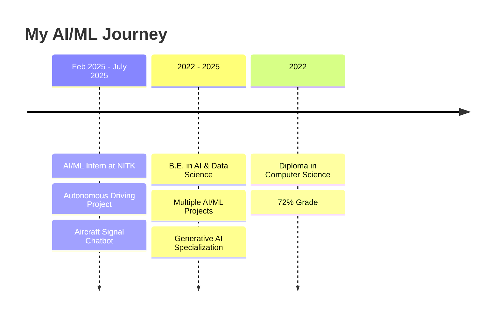
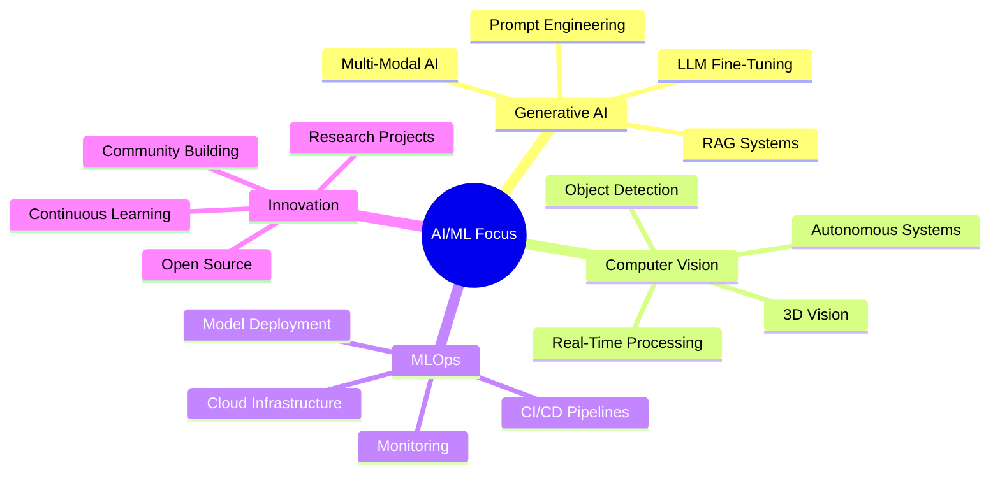

#  Hey there, I'm Sudeep N Shetty

<div align="center">
  
  <!-- SVG Animated 3D Background -->
  <svg width="100%" height="300" xmlns="http://www.w3.org/2000/svg">
    <defs>
      <linearGradient id="grad1" x1="0%" y1="0%" x2="100%" y2="100%">
        <stop offset="0%" style="stop-color:#00D9FF;stop-opacity:1">
          <animate attributeName="stop-color" values="#00D9FF;#667EEA;#764BA2;#00D9FF" dur="8s" repeatCount="indefinite" />
        </stop>
        <stop offset="50%" style="stop-color:#667EEA;stop-opacity:1">
          <animate attributeName="stop-color" values="#667EEA;#764BA2;#00D9FF;#667EEA" dur="8s" repeatCount="indefinite" />
        </stop>
        <stop offset="100%" style="stop-color:#764BA2;stop-opacity:1">
          <animate attributeName="stop-color" values="#764BA2;#00D9FF;#667EEA;#764BA2" dur="8s" repeatCount="indefinite" />
        </stop>
      </linearGradient>
      
      <filter id="glow">
        <feGaussianBlur stdDeviation="4" result="coloredBlur"/>
        <feMerge>
          <feMergeNode in="coloredBlur"/>
          <feMergeNode in="SourceGraphic"/>
        </feMerge>
      </filter>
    </defs>
    
    <rect width="100%" height="100%" fill="url(#grad1)" opacity="0.1"/>
    
    <!-- Animated 3D Spheres -->
    <circle cx="100" cy="150" r="60" fill="none" stroke="#00D9FF" stroke-width="2" opacity="0.3" filter="url(#glow)">
      <animate attributeName="r" values="60;80;60" dur="4s" repeatCount="indefinite"/>
      <animate attributeName="opacity" values="0.3;0.6;0.3" dur="4s" repeatCount="indefinite"/>
      <animateTransform attributeName="transform" type="translate" values="0,0;50,20;0,0" dur="6s" repeatCount="indefinite"/>
    </circle>
    
    <circle cx="200" cy="100" r="40" fill="none" stroke="#667EEA" stroke-width="2" opacity="0.4" filter="url(#glow)">
      <animate attributeName="r" values="40;60;40" dur="5s" repeatCount="indefinite"/>
      <animate attributeName="opacity" values="0.4;0.7;0.4" dur="5s" repeatCount="indefinite"/>
      <animateTransform attributeName="transform" type="translate" values="0,0;-30,40;0,0" dur="7s" repeatCount="indefinite"/>
    </circle>
    
    <circle cx="85%" cy="180" r="70" fill="none" stroke="#764BA2" stroke-width="2" opacity="0.3" filter="url(#glow)">
      <animate attributeName="r" values="70;90;70" dur="6s" repeatCount="indefinite"/>
      <animate attributeName="opacity" values="0.3;0.6;0.3" dur="6s" repeatCount="indefinite"/>
      <animateTransform attributeName="transform" type="translate" values="0,0;-40,-30;0,0" dur="8s" repeatCount="indefinite"/>
    </circle>
    
    <circle cx="70%" cy="80" r="50" fill="none" stroke="#00D9FF" stroke-width="2" opacity="0.4" filter="url(#glow)">
      <animate attributeName="r" values="50;70;50" dur="4.5s" repeatCount="indefinite"/>
      <animate attributeName="opacity" values="0.4;0.8;0.4" dur="4.5s" repeatCount="indefinite"/>
      <animateTransform attributeName="transform" type="translate" values="0,0;30,-20;0,0" dur="5s" repeatCount="indefinite"/>
    </circle>
    
    <!-- Floating Particles -->
    <circle cx="30%" cy="50" r="3" fill="#00D9FF" opacity="0.6">
      <animate attributeName="cy" values="50;250;50" dur="10s" repeatCount="indefinite"/>
      <animate attributeName="opacity" values="0.6;0.2;0.6" dur="10s" repeatCount="indefinite"/>
    </circle>
    
    <circle cx="60%" cy="250" r="4" fill="#667EEA" opacity="0.5">
      <animate attributeName="cy" values="250;50;250" dur="12s" repeatCount="indefinite"/>
      <animate attributeName="opacity" values="0.5;0.8;0.5" dur="12s" repeatCount="indefinite"/>
    </circle>
    
    <circle cx="80%" cy="150" r="3" fill="#764BA2" opacity="0.7">
      <animate attributeName="cy" values="150;80;150" dur="9s" repeatCount="indefinite"/>
      <animate attributeName="opacity" values="0.7;0.3;0.7" dur="9s" repeatCount="indefinite"/>
    </circle>
    
    <circle cx="20%" cy="200" r="5" fill="#00D9FF" opacity="0.4">
      <animate attributeName="cy" values="200;100;200" dur="11s" repeatCount="indefinite"/>
      <animate attributeName="opacity" values="0.4;0.9;0.4" dur="11s" repeatCount="indefinite"/>
    </circle>
    
    <!-- Animated Lines -->
    <line x1="10%" y1="100" x2="30%" y2="200" stroke="#00D9FF" stroke-width="1" opacity="0.2">
      <animate attributeName="x2" values="30%;50%;30%" dur="7s" repeatCount="indefinite"/>
      <animate attributeName="opacity" values="0.2;0.5;0.2" dur="7s" repeatCount="indefinite"/>
    </line>
    
    <line x1="70%" y1="80" x2="90%" y2="180" stroke="#667EEA" stroke-width="1" opacity="0.2">
      <animate attributeName="x1" values="70%;60%;70%" dur="8s" repeatCount="indefinite"/>
      <animate attributeName="opacity" values="0.2;0.5;0.2" dur="8s" repeatCount="indefinite"/>
    </line>
    
    <!-- Text Container -->
    <foreignObject x="0" y="100" width="100%" height="100">
      <div xmlns="http://www.w3.org/1999/xhtml" style="text-align:center; padding:20px;">
        <h1 style="color:#fff; font-size:50px; text-shadow: 0 0 20px rgba(0,217,255,0.8), 0 0 40px rgba(102,126,234,0.6); margin:0; font-family: 'Arial', sans-serif; font-weight: bold;">
          AI & ML Engineer
        </h1>
        <p style="color:#ccc; font-size:18px; margin-top:10px; text-shadow: 0 0 10px rgba(255,255,255,0.5);">
          Building Intelligent Systems with Cutting-Edge AI
        </p>
      </div>
    </foreignObject>
  </svg>
  
  <!-- Dynamic Typing Effect -->
  
  
  <br><br>
  
  <!-- Animated Profile Stats -->
  
  <a href="https://github.com/sudeepshetty-629?tab=followers">
    
  </a>
  
  <br><br>
  
  <!-- Social Links with Hover Animation -->
  <a href="mailto:sudeepshetty0629@gmail.com"></a>
  <a href="https://linkedin.com/in/sudeep-shetty-3882b2348"></a>
  <a href="https://github.com/sudeepshetty-629"></a>
  
</div>

---

## 🚀 About Me

I'm a passionate **AI & Machine Learning Engineer** specializing in building intelligent systems that solve real-world problems. With expertise in **Generative AI, Computer Vision, and LLMOps**, I create innovative solutions that push the boundaries of what's possible with artificial intelligence.

## 💼 What I Do

- 🤖 Develop **Generative AI** applications using state-of-the-art LLMs
- 👁️ Build **Computer Vision** solutions for real-time object detection and analysis
- 🔧 Design and implement **RAG pipelines** for enhanced AI systems
- 📊 Create **ML models** that drive business value and innovation
- 🛠️ Optimize **LLMOps** workflows for production-ready AI applications

## 🛠️ Tech Stack

```text
Languages:        Python, JavaScript, SQL
AI/ML:            TensorFlow, PyTorch, Scikit-learn, Hugging Face
GenAI:            LangChain, LlamaIndex, OpenAI, Anthropic Claude
Computer Vision:  OpenCV, YOLO, Detectron2
MLOps:            Docker, Kubernetes, MLflow, Weights & Biases
Cloud:            AWS, Google Cloud, Azure
Databases:        PostgreSQL, MongoDB, Pinecone, ChromaDB
```

## 📈 GitHub Stats

<div align="center">
  
  
</div>

<div align="center">
  
</div>

---

<div align="center">
  
  ### 💡 "The best way to predict the future is to create it with AI"
  
  
  
</div>

<div align="center">
  
  <!-- 3D Rotating Cube Animation -->
  
  
</div>

## 🚀 About Me


```python
class AIEngineer:
    def __init__(self):
        self.name = "Sudeep N Shetty"
        self.role = "AI & ML Engineer"
        self.location = "Mangalore, Karnataka, India"
        self.education = "B.E. in AI & Data Science"
        self.current_focus = [
            "Generative AI & LLMs",
            "Machine Learning",
            "Agentic AI",
            "Computer Vision",
            "Autonomous Systems",
        ]
        
    def say_hi(self):
        print("Thanks for dropping by! Let's build something amazing together!")

me = AIEngineer()
me.say_hi()
```

<br>

🎓 **AI & Data Science Engineering Student** @ Sahyadri College of Engineering  
🔬 **AI/ML Intern** @ National Institute of Technology Karnataka (NITK)  
💡 Passionate about building intelligent systems that solve real-world problems  

<br clear="right"/>

---

<div align="center">
  
  <!-- Animated Section Divider -->
  
  
</div>

## 🛠️ Tech Stack & Skills

<div align="center">
  
  <!-- Animated Tech Stack -->
  
  
  
  
  
  
  
  
  
  
  
  
  
</div>

<br>

<details open>
<summary><b>🤖 Generative AI & LLMs</b></summary>
<br>

<div align="center">
  


**Expertise:** RAG Systems • Prompt Engineering • Fine-Tuning • LangGraph • LlamaIndex • Vector Databases (FAISS, Chroma, Pinecone)

</div>

</details>

<details open>
<summary><b>🧠 Machine Learning & Deep Learning</b></summary>
<br>

<div align="center">


**Specialization:** CNNs • RNNs • Transformers • NLP • Time-Series Forecasting • Anomaly Detection

</div>

</details>

<details open>
<summary><b>👁️ Computer Vision</b></summary>
<br>

<div align="center">


**Focus:** Object Detection • Image Segmentation • Real-Time Processing • 3D Vision • DeepSORT Tracking

</div>

</details>

<details open>
<summary><b>💻 Programming & Development</b></summary>
<br>

<div align="center">


</div>

</details>

<details open>
<summary><b>☁️ MLOps & Cloud</b></summary>
<br>

<div align="center">


**Skills:** CI/CD Pipelines • ETL Workflows • Microservices • LLMOps Automation • Model Deployment

</div>

</details>

---

<div align="center">
  
  <!-- Animated Section Divider -->
  
  
</div>

## 🎯 Featured Projects

<div align="center">
  
  <!-- Project Cards with Animations -->
  
  
</div>

<table>
<tr>
<td width="50%">

### 🤖 Multi-Modal RAG System
[](https://github.com)
[](https://demo.com)


**Enterprise-grade conversational AI for intelligent document analysis**

✨ **Highlights:**
- 🎯 80% reduction in LLM hallucinations
- 📊 40% improvement in retrieval accuracy
- 🔍 Processes 10K+ document chunks
- 🖼️ Multi-modal: Text, Tables, Images

**Tech:** PyTorch, Gemini, FAISS, FastAPI, React, MongoDB

</td>
<td width="50%">

### 🚗 Autonomous Driving Simulation
[](https://nitk.ac.in)


**End-to-end autonomous driving with multi-sensor perception**

✨ **Highlights:**
- 🎥 Real-time 3D visualization
- 📡 LiDAR + Camera sensor fusion
- 🚙 978 vehicles detected (78.6% accuracy)
- 🗺️ Geospatial environment modeling

**Tech:** Python, PyTorch, YOLOv8, PV-RCNN, Babylon.js

</td>
</tr>

<tr>
<td width="50%">

### ✈️ Aircraft Signal Chatbot
[](https://nitk.ac.in)


**LLM-powered intelligent monitoring system**

✨ **Highlights:**
- 📈 70% improvement in monitoring efficiency
- 🎯 90%+ forecasting accuracy
- 🔍 25% better anomaly detection
- ⚡ Real-time signal interpretation

**Tech:** LLaMA 3.1, LangChain, Flask, Scikit-learn

</td>
<td width="50%">

### 🌊 Underwater Object Detection
[](https://github.com)


**Real-time marine object detection system**

✨ **Highlights:**
- 📹 30+ FPS real-time processing
- 🎯 78% detection accuracy
- 🌊 Low-visibility optimization
- 🎨 Advanced image enhancement

**Tech:** YOLOv5, OpenCV, Streamlit, PyTorch

</td>
</tr>
</table>

---

<div align="center">
  
  <!-- Animated Section Divider -->
  
  
</div>

## 📊 GitHub Analytics

<div align="center">
  
  <!-- Animated Stats -->
  
  
</div>

<br>

<p align="center">
  
  
</p>

<p align="center">
  
</p>

<p align="center">
  
</p>

---

<div align="center">
  
  <!-- Animated Section Divider -->
  
  
</div>

## 🏆 Achievements & Certifications

<div align="center">
  
  
  
  <p>
    
    
  </p>

</div>

<br>

🎓 **Oracle Cloud Infrastructure Certified Generative AI Professional** (Sep 2025)  
📊 **Data Analytics Certification** - Infosys (Dec 2024)  
🔬 **AI/ML Internship** - NITK Centre for System Design (Feb 2025 - July 2025)

---

<div align="center">
  
  <!-- Animated Section Divider -->
  
  
</div>

## 💼 Professional Experience

<div align="center">
  
  
  
</div>



---

<div align="center">
  
  <!-- Animated Section Divider -->
  
  
</div>

## 🎨 Skills Proficiency

<div align="center">
  
  
  
</div>

<br>

<div align="center">

### Core Competencies

| Domain | Skills | Proficiency |
|--------|--------|-------------|
| 🤖 **Generative AI** | LLMs, RAG, Prompt Engineering, Fine-Tuning | ⭐⭐⭐⭐⭐ |
| 🧠 **Machine Learning** | PyTorch, TensorFlow, Scikit-learn | ⭐⭐⭐⭐⭐ |
| 👁️ **Computer Vision** | YOLO, OpenCV, Object Detection | ⭐⭐⭐⭐⭐ |
| 📊 **Data Science** | Analysis, Visualization, Feature Engineering | ⭐⭐⭐⭐ |
| ☁️ **MLOps** | Docker, CI/CD, Cloud Deployment | ⭐⭐⭐⭐ |

</div>

---

<div align="center">
  
  <!-- Animated Section Divider -->
  
  
</div>

## 📈 Contribution Graph

<div align="center">
  
  <picture>
    <source media="(prefers-color-scheme: dark)" srcset="https://raw.githubusercontent.com/sudeepshetty-629/sudeepshetty-629/output/github-contribution-grid-snake-dark.svg">
    <source media="(prefers-color-scheme: light)" srcset="https://raw.githubusercontent.com/sudeepshetty-629/sudeepshetty-629/output/github-contribution-grid-snake.svg">
    
  </picture>
  
</div>

---

<div align="center">
  
  <!-- Animated Section Divider -->
  
  
</div>

## 🎯 Current Focus Areas

<div align="center">
  
  
  
</div>

<br>

<div align="center">



</div>

---

<div align="center">
  
  <!-- Animated Section Divider -->
  
  
</div>

## 📫 Let's Connect!

<div align="center">
  
  

  ### 💬 Open for opportunities in:
  **AI/ML Engineering** | **Generative AI** | **Computer Vision** | **Research & Development**

  <br>

  <a href="mailto:sudeepshetty0629@gmail.com">
    
  </a>
  <a href="https://linkedin.com/in/sudeep-shetty-3882b2348">
    
  </a>
  <a href="https://github.com/sudeepshetty-629">
    
  </a>

  <br><br>

  ### ⚡ Fun Fact
  *"I turn coffee ☕ into code and data into intelligence 🧠"*

  <br>
  
  

  <br><br>

  

</div>

---

<div align="center">
  
  
  
  
  
  <br><br>
  
  **⭐ If you find my work interesting, consider starring my repositories! ⭐**
  
  <br>
  
  
  
</div>
